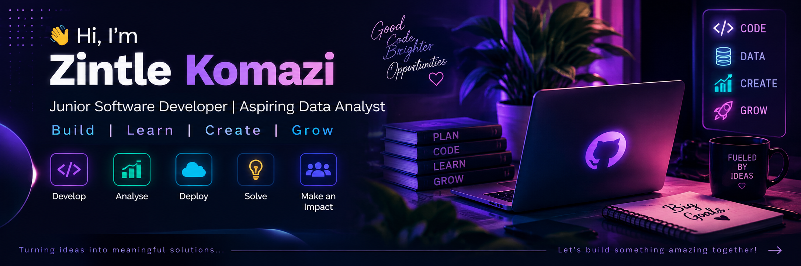

  

 

### 👩🏽‍💻 Building, Learning & Creating

 

 

## 👤 About Me

I'm a Computer Science graduate who enjoys building web applications, working with data, and turning ideas into practical digital solutions. I enjoy learning new technologies, solving problems, and creating user-focused experiences.

<table>
<tr>
<td width="25%">

🎓 **BSc IT**  
Honours CS & Informatics

</td>
<td width="25%">

💻 **Junior Software Developer**  
Building full-stack applications

</td>
<td width="25%">

📊 **Data Analytics**  
Working toward Data Engineering

</td>
<td width="25%">

🌱 **Always Learning**  
Building • Improving • Growing

</td>
</tr>
</table>

 

## ⚙️ Tech Stack

<table>
<tr>
<td valign="top" width="55%">

### 💻 Languages

</td>

<td valign="top" width="45%">

### 🧩 Frameworks & Development

</td>
</tr>

<tr>
<td valign="top">

### 🗄️ Databases

&nbsp;

</td>

<td valign="top">

### ☁️ Cloud & DevOps

</td>
</tr>

<tr>
<td colspan="2">

### 🛠️ Tools & Design

&nbsp;

</td>
</tr>
</table>

 
